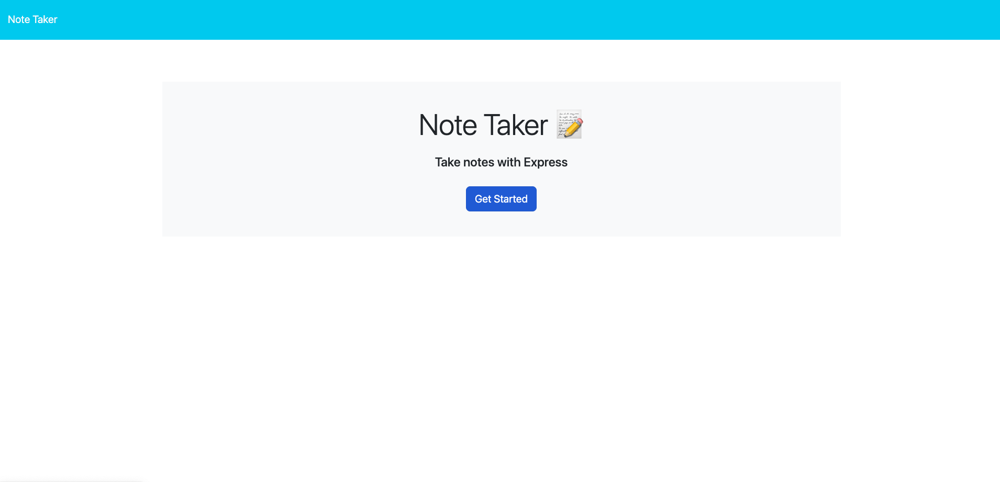

# note-taker

## Description

This app allows users to create and store notes using and Express.js server.

## Table of Contents

[Installation](#installation)

[Usage](#usage)

[Contributing](#contributing)

[Tests](#tests)

[License](#license)

[Questions](#questions)

## Installation

N/A

## Usage

Visit the application link at:
[https://note-taker-9000.herokuapp.com/](https://note-taker-9000.herokuapp.com/)

## Contributing

To contribute, reach out to me via contact info in the Questions section.

## Tests

None.

## Questions

GitHub: [jboyce313](https://github.com/jboyce313)

For questions, email me at [jboyce313@gmail.com](mailto:jboyce313@gmail.com)
